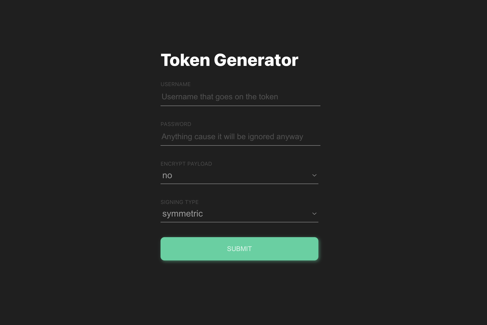

# All things JWT
<!-- ABOUT THE PROJECT -->
## Features
This project is designed to be a playground demonstrating how JWT, JWK, and JWE works.



Inside the application you will be able to select:
* Whether to use encrypt the token using JWE
* Whether to use asymmetric signature/encryption using JWK
  
Note: the password is simply a placeholder and is not used for any kind of authentication

<!-- GETTING STARTED -->
## Getting Started
The project consists of two packages `backend` and `frontend` managed using yarn workspace.

### Installation
To install the depency, simply run: 
```sh
yarn
```

### Running
To run both `frontend` and `backend`,
```sh
yarn start
```
This will run a React app on http://localhost:3000 and an express app on http://localhost:3001

To run `backend` service separately,
```sh
yarn backend
```

Or to run the `frontend` service alone,
```sh
yarn frontend
```
